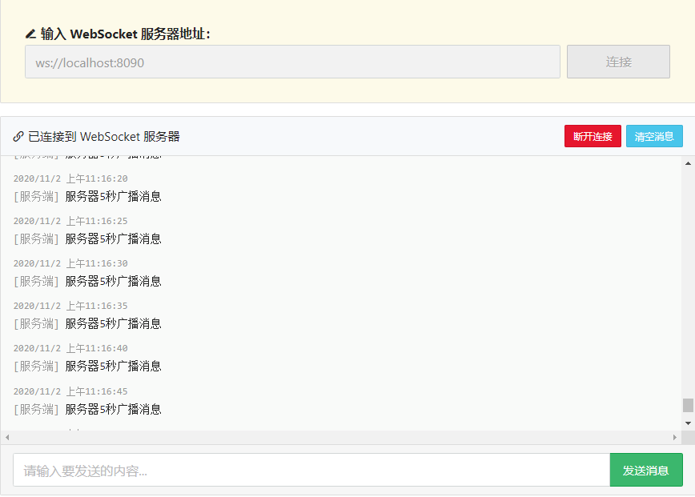
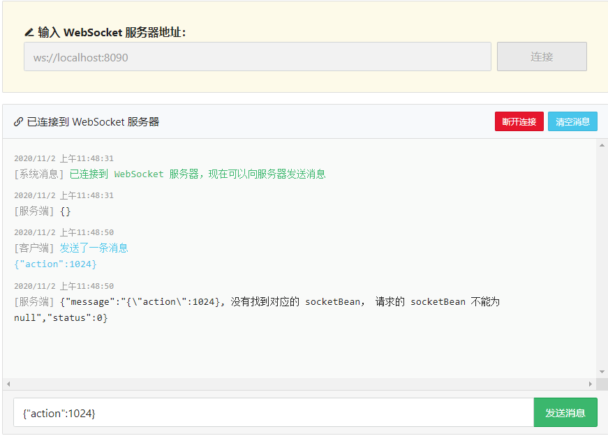
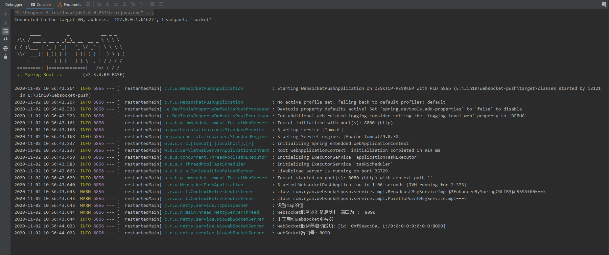
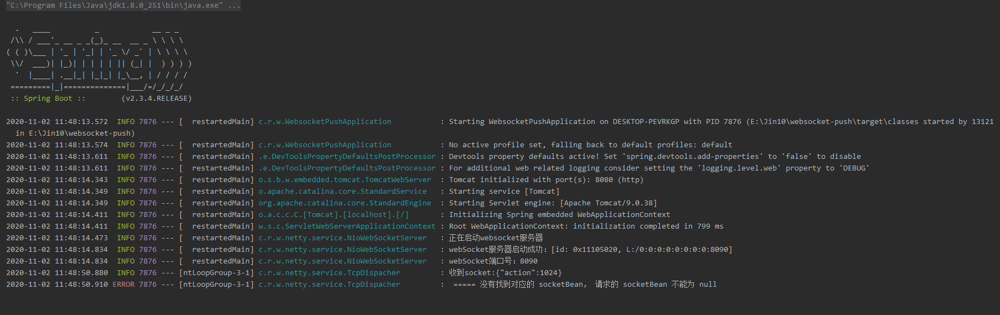

## SpringBoot基于WebSocket进行推送

### 1. 整体流程

   客户端发起http请求，请求Netty服务器进行WebSocket连接，服务器接收后请求后进行注册信道并登记客户端IP地址，如此一来就建立了WebSocket通讯连接。
   
   上面的论述可以得出，我们可以比较Http和WebSocket两者之间的关系和区别
   
   - 都是基于TCP协议的两种通信协议；
   
   - 两者不相同但是WebSocket又依赖于Http，毕竟建立WebSocket通讯首次请求需要使用Http请求；
   
   - Http请求只能是客户端对服务器进行发送消息，服务器是被动的；而WebSocket则允许双方可以任由一方主动发送消息给另外一方，而且能够长时间连接，只要任何一方不断开的话。
   
   **基于上述WebSocket的特点，可以实现在线设备的消息推送**
   
### 2. Springboot整合WebSocket

   - 2.1 依赖添加
   
   ```xml
   <dependency>
               <groupId>io.netty</groupId>
               <artifactId>netty-all</artifactId>
           </dependency>
   
           <!-- hutool-all工具库 -->
           <dependency>
               <groupId>cn.hutool</groupId>
               <artifactId>hutool-all</artifactId>
               <version>5.4.6</version>
           </dependency>
   
           <!-- fastjson依赖 -->
           <dependency>
               <groupId>com.alibaba</groupId>
               <artifactId>fastjson</artifactId>
               <version>1.2.74</version>
           </dependency>
   
           <!-- aop依赖 -->
           <dependency>
               <groupId>org.springframework.boot</groupId>
               <artifactId>spring-boot-starter-aop</artifactId>
           </dependency>
   ```
   
   - 2.2 WebSocket信道处理实现，处理通讯的业务逻辑
   
   ```java
   package com.ryan.websocketpush.netty.handler;
   
   
   import com.alibaba.fastjson.JSONObject;
   
   import com.ryan.websocketpush.netty.global.ChannelSupervise;
   import com.ryan.websocketpush.netty.service.TcpDispacher;
   import io.netty.buffer.ByteBuf;
   import io.netty.buffer.Unpooled;
   import io.netty.channel.*;
   import io.netty.handler.codec.http.DefaultFullHttpResponse;
   import io.netty.handler.codec.http.FullHttpRequest;
   import io.netty.handler.codec.http.HttpResponseStatus;
   import io.netty.handler.codec.http.HttpVersion;
   import io.netty.handler.codec.http.websocketx.*;
   import io.netty.util.CharsetUtil;
   import org.slf4j.Logger;
   import org.slf4j.LoggerFactory;
   import org.springframework.beans.factory.annotation.Autowired;
   import org.springframework.stereotype.Component;
   
   import java.util.Date;
   import static io.netty.handler.codec.http.HttpUtil.isKeepAlive;
   
   @Component
   @ChannelHandler.Sharable
   public class NioWebSocketHandler extends SimpleChannelInboundHandler<Object> {
   
       private final Logger logger = LoggerFactory.getLogger(getClass());
   
       private WebSocketServerHandshaker handshaker;
   
       @Autowired
       private TcpDispacher tcpDispacher;
   
   
       /**
        * 服务器接收消息
        *
        * @param ctx
        * @param msg
        * @throws Exception
        */
       @Override
       protected void channelRead0(ChannelHandlerContext ctx, Object msg) throws Exception {
           logger.debug("收到消息：" + msg);
           if (msg instanceof FullHttpRequest) {             //第一次通过Http请求进行WebSocket通讯连接
               //以http请求形式接入，但是走的是websocket
               handleHttpRequest(ctx, (FullHttpRequest) msg);
               JSONObject jsonObject = new JSONObject();
               String result = jsonObject.toJSONString();
               TextWebSocketFrame tws = new TextWebSocketFrame(result);
               ctx.channel().writeAndFlush(tws);
           } else if (msg instanceof WebSocketFrame) {
               //处理websocket客户端的消息
               logger.debug("收到消息：" + msg);
               handlerWebSocketFrame(ctx, (WebSocketFrame) msg);
           }
       }
   
   
       /**
        * 客户端连接并添加通道
        *
        * @param ctx
        * @throws Exception
        */
       @Override
       public void channelActive(ChannelHandlerContext ctx) throws Exception {
           //添加连接
           logger.debug("客户端加入连接：" + ctx.channel());
           ChannelSupervise.addChannel(ctx.channel());
   //        SocketActiveRequest socketActiveRequest = new SocketActiveRequest();
   //        socketActiveRequest.setIp(NettyUtils.getClientIP(ctx));
   //        socketActiveRequest.setStatus(Constants.SOCKET_STATUS.LOGIN);
   //        tcpDispacher.messageRecived(ctx, JsonUtil.toJson(socketActiveRequest));
       }
   
       /**
        * 客户端断开并删除通道
        *
        * @param ctx
        * @throws Exception
        */
       @Override
       public void channelInactive(ChannelHandlerContext ctx) throws Exception {
           //断开连接
           logger.debug("客户端断开连接：" + ctx.channel());
   
           TextWebSocketFrame tws = new TextWebSocketFrame("break");
           ctx.channel().writeAndFlush(tws);
   
   
       }
   
   
       @Override
       public void channelReadComplete(ChannelHandlerContext ctx) throws Exception {
           ctx.flush();
       }
   
       private void handlerWebSocketFrame(ChannelHandlerContext ctx, WebSocketFrame frame) {
   
   
           /**
            * 判断是否关闭链路的指令
            */
           if (frame instanceof CloseWebSocketFrame) {
               ChannelSupervise.removeChannel(ctx.channel());
               handshaker.close(ctx.channel(), (CloseWebSocketFrame) frame.retain());
               return;
           }
           /**
            * 判断是否ping消息
            */
           if (frame instanceof PingWebSocketFrame) {
               ctx.channel().write(
                       new PongWebSocketFrame(frame.content().retain()));
               return;
           }
           /**
            * 仅支持文本消息，不支持二进制消息
            */
           if (!(frame instanceof TextWebSocketFrame)) {
               logger.debug("仅支持文本消息，不支持二进制消息");
               throw new UnsupportedOperationException(String.format(
                       "%s frame types not supported", frame.getClass().getName()));
           }
   
   
           /**
            * 返回应答消息
            */
           String request = ((TextWebSocketFrame) frame).text();
   
           tcpDispacher.messageRecived(ctx, request);
   
   
           logger.debug("服务端收到：" + request);
           TextWebSocketFrame tws = new TextWebSocketFrame(new Date().toString()
                   + ctx.channel().id() + "：" + request);
   
   
           //群发
           //ChannelSupervise.send2All(tws);
   
   
           //        /**
           //         * 返回【谁发的发给谁】
           //         */
   //         ctx.channel().writeAndFlush(tws);
       }
   
       /**
        * 唯一的一次http请求，用于创建websocket
        */
       private void handleHttpRequest(ChannelHandlerContext ctx,
                                      FullHttpRequest req) {
           //要求Upgrade为websocket，过滤掉get/Post
           if (!req.decoderResult().isSuccess()
                   || (!"websocket".equals(req.headers().get("Upgrade")))) {
               //若不是websocket方式，则创建BAD_REQUEST的req，返回给客户端
               sendHttpResponse(ctx, req, new DefaultFullHttpResponse(
                       HttpVersion.HTTP_1_1, HttpResponseStatus.BAD_REQUEST));
               return;
           }
           WebSocketServerHandshakerFactory wsFactory = new WebSocketServerHandshakerFactory("ws://localhost:8088/websocket", null, false);
           handshaker = wsFactory.newHandshaker(req);
           if (handshaker == null) {
               WebSocketServerHandshakerFactory
                       .sendUnsupportedVersionResponse(ctx.channel());
           } else {
               handshaker.handshake(ctx.channel(), req);
           }
       }
   
       /**
        * 拒绝不合法的请求，并返回错误信息
        */
       private static void sendHttpResponse(ChannelHandlerContext ctx,
                                            FullHttpRequest req, DefaultFullHttpResponse res) {
           /**
            *  返回应答给客户端
            */
           if (res.status().code() != 200) {
               ByteBuf buf = Unpooled.copiedBuffer(res.status().toString(),
                       CharsetUtil.UTF_8);
               res.content().writeBytes(buf);
               buf.release();
           }
           ChannelFuture f = ctx.channel().writeAndFlush(res);
   
           /**
            * 如果是非Keep-Alive，关闭连接
            */
           if (!isKeepAlive(req) || res.status().code() != 200) {
               f.addListener(ChannelFutureListener.CLOSE);
           }
       }
   }

   ```

   - 2.3 连接通信信道的初始化注册
   
   ```java
   package com.ryan.websocketpush.netty.handler;
   
   import io.netty.channel.ChannelInitializer;
   import io.netty.channel.socket.SocketChannel;
   import io.netty.handler.codec.http.HttpObjectAggregator;
   import io.netty.handler.codec.http.HttpServerCodec;
   import io.netty.handler.logging.LoggingHandler;
   import io.netty.handler.stream.ChunkedWriteHandler;
   import org.springframework.beans.factory.annotation.Autowired;
   import org.springframework.stereotype.Component;
   
   @Component
   public class NioWebSocketChannelInitializer extends ChannelInitializer<SocketChannel> {
   
       @Autowired
       private NioWebSocketHandler socketHandler ;
   
       @Override
       protected void initChannel(SocketChannel ch) {
           ch.pipeline().addLast("logging",new LoggingHandler("DEBUG"));                        //设置log监听器，并且日志级别为debug，方便观察运行流程
           ch.pipeline().addLast("http-codec",new HttpServerCodec());                           //设置解码器
           ch.pipeline().addLast("aggregator",new HttpObjectAggregator(65536));                 //聚合器，使用websocket会用到
           ch.pipeline().addLast("http-chunked",new ChunkedWriteHandler());                     //用于大数据的分区传输
           ch.pipeline().addLast("handler", socketHandler);                                     //自定义的业务handler
       }
   }
   ```

  - 2.4 注册完信道Channel后，要对信道进行通过全局管理起来
  
  ```java
  package com.ryan.websocketpush.netty.global;
  
  import cn.hutool.core.collection.CollUtil;
  import com.ryan.websocketpush.utils.JsonUtils2;
  import io.netty.channel.Channel;
  import io.netty.channel.ChannelId;
  import io.netty.channel.group.ChannelGroup;
  import io.netty.channel.group.DefaultChannelGroup;
  import io.netty.handler.codec.http.websocketx.TextWebSocketFrame;
  import io.netty.util.concurrent.GlobalEventExecutor;
  
  import java.util.concurrent.ConcurrentHashMap;
  import java.util.concurrent.ConcurrentMap;
  
  /**
   * 频道管理
   */
  public class ChannelSupervise {
  
      /**
       * 频道集群管理
       */
      private static ChannelGroup GlobalGroup = new DefaultChannelGroup(GlobalEventExecutor.INSTANCE);
  
      /**
       * 频道管理 【channel.id().asShortText()：channel.id()】
       */
      private static ConcurrentMap<String, ChannelId> ChannelMap = new ConcurrentHashMap();
  
      /**
       * （动作码：频道）映射
       */
      private static ConcurrentHashMap<Object, ChannelGroup> actionGlobalGroupMap = new ConcurrentHashMap<>();
  
  
      /**
       * 增加频道
       *
       * @param channel
       */
      public static void addChannel(Channel channel) {
          GlobalGroup.add(channel);
          ChannelMap.put(channel.id().asShortText(), channel.id());
      }
  
      /**
       * 移除频道
       *
       * @param channel
       */
      public static void removeChannel(Channel channel) {
          GlobalGroup.remove(channel);
          ChannelMap.remove(channel.id().asShortText());
          removeChannelByActionCode(channel);
      }
  
      /**
       * 查找频道
       *
       * @param id
       * @return
       */
      public static Channel findChannel(String id) {
          return GlobalGroup.find(ChannelMap.get(id));
      }
  
      /**
       * 推送消息
       *
       * @param tws
       */
      public static void send2All(TextWebSocketFrame tws) {
          GlobalGroup.writeAndFlush(tws);
      }
  
  
      public static void addChannelByActionCode(Channel channel, int actionCode) {
          ChannelGroup channels = actionGlobalGroupMap.get(actionCode);
          if (channels == null){
              channels =  new DefaultChannelGroup(GlobalEventExecutor.INSTANCE);
          }
          channels.add(channel);
          actionGlobalGroupMap.put(actionCode, channels);
         // addChannelByObject(channel, actionCode);
      }
  
  
      public static void addChannelByObject(Channel channel, Object object) {
          ChannelGroup channels = actionGlobalGroupMap.get(object);
          if (channels == null){
              channels =  new DefaultChannelGroup(GlobalEventExecutor.INSTANCE);
          }
          channels.add(channel);
          actionGlobalGroupMap.put(object, channels);
      }
  
  
  
      public static void removeChannelByActionCode(Channel channel){
          for (Object actionCode : actionGlobalGroupMap.keySet()){
              ChannelGroup channels = actionGlobalGroupMap.get(actionCode);
              removeChannel(channels, channel);
          }
      }
  
      private static void removeChannel(ChannelGroup channels , Channel channel){
          if (channels != null && channel != null){
              channels.remove(channel);
              channels.remove(channel.id().asShortText());
          }
      }
  
  
      public static void removeByObjectChannel(Channel channel, Object object){
          ChannelGroup channels = actionGlobalGroupMap.get(object);
          removeChannel(channels, channel);
      }
  
  
      /**
       * 发送到所有在线设备（通过动作码去推送消息）
       *
       * @param action
       * @param entity
       */
      public static void send2AllAction(Object action, Object entity) {
          ChannelGroup channels = actionGlobalGroupMap.get(action);
          if (channels != null){
              channels.writeAndFlush( new TextWebSocketFrame(JsonUtils2.writeValue(entity)));
          }
      }
  
  
      public static boolean existActionChannelGroup(int action){
          return CollUtil.isNotEmpty(actionGlobalGroupMap.get(action));
      }
  
  
      public static boolean existObjectChannelGroup(Object object){
          return CollUtil.isNotEmpty(actionGlobalGroupMap.get(object));
      }
  
  
  }

  ```

  - 2.5 配置好Netty服务器之后，然后创建一新的线程进行Netty服务器的
  
  ```java
  package com.ryan.websocketpush.netty.service;
  
  import com.ryan.websocketpush.netty.handler.NioWebSocketChannelInitializer;
  import io.netty.bootstrap.ServerBootstrap;
  import io.netty.channel.Channel;
  import io.netty.channel.nio.NioEventLoopGroup;
  import io.netty.channel.socket.nio.NioServerSocketChannel;
  import org.slf4j.Logger;
  import org.slf4j.LoggerFactory;
  import org.springframework.beans.factory.annotation.Autowired;
  import org.springframework.beans.factory.annotation.Value;
  import org.springframework.context.annotation.Bean;
  import org.springframework.stereotype.Component;
  
  @Component
  public class NioWebSocketServer {
      private final Logger logger = LoggerFactory.getLogger(getClass());
  
      @Autowired
      private NioWebSocketChannelInitializer channelInitializer;
  
      public void init(Integer webSocketPort) {
          logger.info("正在启动websocket服务器");
          NioEventLoopGroup boss = new NioEventLoopGroup();
          NioEventLoopGroup work = new NioEventLoopGroup();
          try {
              ServerBootstrap bootstrap = new ServerBootstrap();
              bootstrap.group(boss, work);
              bootstrap.channel(NioServerSocketChannel.class);
              bootstrap.childHandler(channelInitializer);
              Channel channel = bootstrap.bind(webSocketPort).sync().channel();
              logger.info("webSocket服务器启动成功：" + channel);
              logger.info("webSocket端口号：" + webSocketPort);
              channel.closeFuture().sync();
          } catch (InterruptedException e) {
              e.printStackTrace();
              logger.info("运行出错：" + e);
          } finally {
              boss.shutdownGracefully();
              work.shutdownGracefully();
              logger.info("websocket服务器已关闭");
          }
      }
  
  }
  ```

  创建线程启动Netty服务器
  
  ```java
  package com.ryan.websocketpush.netty.mainThread;
  
  import com.ryan.websocketpush.netty.service.NioWebSocketServer;
  import lombok.extern.slf4j.Slf4j;
  import org.springframework.beans.factory.annotation.Autowired;
  import org.springframework.beans.factory.annotation.Value;
  import org.springframework.boot.CommandLineRunner;
  import org.springframework.stereotype.Component;
  
  import java.util.List;
  
  /**
   * Netty服务线程启动
   *
   */
  @Component
  @Slf4j
  public class NettyServerThread implements CommandLineRunner {
  
      @Autowired
      private NioWebSocketServer nettyServer;
  
      @Value("${webSokcet.port}")
      private Integer webSocketPort;
  
      @Override
      public void run(String... args) throws Exception {
          log.warn("websocket服务器准备启动！ 端口为 :  " + webSocketPort);
          nettyServer.init(webSocketPort);
  
      }
  }
  ```

 也许这里，有些疑问为什么需要创建线程来启动Netty服务器，这里尝试一下如果没有创建线程，直接在Main主线程启动，看看会有什么问题？这个问题留着后面再去说明
 
 在配置文件中进行WebSocket的端口配置
 
 ```properties 
  webSokcet.port=8090
 ```
 
 上面的步骤进行完成了一个Netty服务器的初始化启动和端口监听，这时候会有疑问了，消息推送功能还没有实现。所以下面就是我们如何去实现消息处理逻辑
 
 - 2.6 编写自定义注解
 
   - WebSocket动作码注解
 
     ```java
     package com.ryan.websocketpush.annotation;
     
     import java.lang.annotation.*;
     
     /**
      *
      * socket 动作码 注解
      */
     @Retention(RetentionPolicy.RUNTIME)
     @Target(ElementType.TYPE)
     @Documented
     public @interface ActionCode {
     
         int value();
     }
     ```
   - WebSocket消息响应体注解
   
     ```java
     package com.ryan.websocketpush.annotation;
     
     import java.lang.annotation.*;
     
     /**
      * socket 返回 数据 注解
      * 自动解析为 json 并返回
      */
     @Retention(RetentionPolicy.RUNTIME)
     @Target(ElementType.METHOD)
     @Documented
     public @interface SocketResponseBody {
     
     }
     ```
     
 - 2.7 消息动作码定义类
 
   ```java
   package com.ryan.websocketpush.netty.constants;
   
   /**
    * socket消息状态码定义类
    * ----------------------------------------------
    */
   public interface ActionCodeConstants {
   
       /**
        * 广播消息
        */
       int PUSH_MSG = 1024;
   
       /**
        * 指定用户消息
        */
       int SPECIAL_MSG = 1025;
   
   }
   ```
   
   **通过定义不同的消息状态可以实现不同类型的消息推送**，这里我们暂且只定义一个广播的消息状态码。何为广播，就是只要你客户端请求接入Netty服务器，就给推送消息，人人有份。
   
 - 2.8 下面是真正消息业务处理逻辑实现类了
 
   - 创建消息处理接口，往后不同状态码的消息处理类都要实现这个接口，通过doAction()方法实现不同消息业务逻辑实现，这里简单实现一个点对点订阅推送
   
     ```java
     package com.ryan.websocketpush.netty.interf;
       
     import io.netty.channel.ChannelHandlerContext;
       
     public interface IActionSocketService {
       
         Object doAction(ChannelHandlerContext context, String message);
      }

     ```
   
   - 点对点消息实现类
   
     ```java
     package com.ryan.websocketpush.service.impl;
     
     import com.alibaba.fastjson.JSONObject;
     import com.ryan.websocketpush.annotation.ActionCode;
     import com.ryan.websocketpush.netty.constants.ActionCodeConstants;
     import com.ryan.websocketpush.netty.global.ChannelSupervise;
     import com.ryan.websocketpush.netty.interf.IActionSocketService;
     import io.netty.channel.ChannelHandlerContext;
     import lombok.extern.slf4j.Slf4j;
     import org.springframework.stereotype.Service;
     
     
     @Service
     @Slf4j
     @ActionCode(ActionCodeConstants.SPECIAL_MSG)
     public class PointToPointMsgServiceImpl implements IActionSocketService {
         @Override
         public Object doAction(ChannelHandlerContext context, String message) {
             log.info("收到终端请求 === " + message);
             JSONObject parseJson = JSONObject.parseObject(message);
             Integer actionCode = parseJson.getInteger("action");
             ChannelSupervise.removeChannel(context.channel());             //去除广播推送
             ChannelSupervise.addChannelByActionCode(context.channel(), actionCode);
             return "发送指定用户信息";
         }
     }
     ```
     
   **也许会有怎么识别出那个状态码对应哪个业务逻辑代码实现？这时候上面所定义的@ActionCode自定义注解就起到作用了**
   
   - 提取一个请求里面的状态码，并对应到消息实现类，也就是WebSocket请求结构体
   
     ```java
     package com.ryan.websocketpush.netty.bean;
       
     import cn.hutool.json.JSONUtil;
     import lombok.Data;
       
     
     @Data
      public class BaseSocketRequest {
       
         private Integer action;
         private String ip;
       
       
       
         /**
           * 获取对应请求的bean
           *
           * @param json
           * @return 对应的bean
           */
         public static BaseSocketRequest toBean(String json){
             if(JSONUtil.isJson(json)){
                 BaseSocketRequest socketRequest = JSONUtil.toBean(json, BaseSocketRequest.class);
                 if (socketRequest != null && socketRequest.getAction() != null){
                     return socketRequest;
                 }
             }
             return null;
         }
     }
     ```

 
 - 2.9 如何去返回最后的结果？这里通过切面编程的方式去统一的返回结果
 
   - 自定义WebSocketResponseBody注解
   
     ```java
     package com.ryan.websocketpush.annotation;
     
     import java.lang.annotation.*;
     
     /**
      * socket 返回 数据 注解
      * 自动解析为 json 并返回
      */
     @Retention(RetentionPolicy.RUNTIME)
     @Target(ElementType.METHOD)
     @Documented
     public @interface SocketResponseBody {
     
     }
     ```
     
   - 切面编程
   
     ```java
     package com.ryan.websocketpush.netty.aspect;
     
     import com.ryan.websocketpush.utils.JsonUtils2;
     import io.netty.channel.ChannelHandlerContext;
     import io.netty.handler.codec.http.websocketx.TextWebSocketFrame;
     import org.aspectj.lang.ProceedingJoinPoint;
     import org.aspectj.lang.annotation.Around;
     import org.aspectj.lang.annotation.Aspect;
     import org.aspectj.lang.annotation.Pointcut;
     import org.springframework.stereotype.Component;
     
     @Aspect
     @Component
     public class SocketResponseBodyAspect {
     
         @Pointcut("@annotation(com.ryan.websocketpush.annotation.SocketResponseBody)")
         public void pointCut() {
     
         }
     
         @Around("pointCut()")
         public Object around(ProceedingJoinPoint point) throws Throwable {
     
             /**
              * 获取返回结果
              */
             Object proceed = point.proceed();
             /**
              * 获取方法参数
              */
             Object[] args = point.getArgs();
     
             if (args.length > 0) {
                 if (args[0] instanceof ChannelHandlerContext){
                     TextWebSocketFrame tws = new TextWebSocketFrame( JsonUtils2.writeValue(proceed));
                     ChannelHandlerContext context = (ChannelHandlerContext) args[0];
                     context.channel().writeAndFlush(tws);        //通过信道发送消息
                 }
             }
             return proceed;
         }
     
     }
     ```
     
 - 2.10 定时任务模拟消息推送
 
   ```java
   package com.ryan.websocketpush.scheduler;
   
   import com.ryan.websocketpush.netty.constants.ActionCodeConstants;
   import com.ryan.websocketpush.netty.global.ChannelSupervise;
   import io.netty.handler.codec.http.websocketx.TextWebSocketFrame;
   import org.springframework.scheduling.annotation.Scheduled;
   import org.springframework.stereotype.Component;
   
   /**
    * 消息推送
    */
   @Component
   public class PushTask {
   
       @Scheduled(cron = "0/5 * * * * ? ")
       public void pushAll() {
           TextWebSocketFrame textWebSocketFrame = new TextWebSocketFrame("服务器5秒广播消息");
           ChannelSupervise.send2All(textWebSocketFrame);
       }
   
       @Scheduled(cron = "0/10 * * * * ? ")
       public void pushAllByActionCode() {
           TextWebSocketFrame textWebSocketFrame = new TextWebSocketFrame("服务器10秒指定用户消息");
           ChannelSupervise.send2AllAction(ActionCodeConstants.SPECIAL_MSG, textWebSocketFrame);
       }
   }
   ```
 
 - 2.11 测试结果
 
   - 广播消息，只要客户端接入就可以收到服务器端发送过来的消息
   
     
  
   - 上面提到为什么要开启线程进行Netty服务器的启动，这里就来验证一次，如果不开启线程看看会是怎样的结果
   
     - 注释代码
     
     ```java
     @Autowired
     private NioWebSocketServer nettyServer;
     
     @Value("${webSokcet.port}")
     private Integer webSocketPort;
     
     @Override
     public void run(String... args) throws Exception {
         log.warn("websocket服务器准备启动！ 端口为 :  " + webSocketPort);
             //nettyServer.init(webSocketPort);
     
     }
     ```
     
     - 在Main主线程中开启Netty
     
     ```java
         @Autowired
         private NioWebSocketChannelInitializer channelInitializer;
     
         @Value("${webSokcet.port}")
         private Integer webSocketPort;
         
         @Bean
         public void init() {
             logger.info("正在启动websocket服务器");
             NioEventLoopGroup boss = new NioEventLoopGroup();
             NioEventLoopGroup work = new NioEventLoopGroup();
             try {
                 ServerBootstrap bootstrap = new ServerBootstrap();
                 bootstrap.group(boss, work);
                 bootstrap.channel(NioServerSocketChannel.class);
                 bootstrap.childHandler(channelInitializer);
                 Channel channel = bootstrap.bind(webSocketPort).sync().channel();
                 logger.info("webSocket服务器启动成功：" + channel);
                 logger.info("webSocket端口号：" + webSocketPort);
                 channel.closeFuture().sync();
             } catch (InterruptedException e) {
                 e.printStackTrace();
                 logger.info("运行出错：" + e);
             } finally {
                 boss.shutdownGracefully();
                 work.shutdownGracefully();
                 logger.info("websocket服务器已关闭");
             }
         }
     ```
     
     - 连接上后，并没有接收到广播信息；并且发送信息会出现如下这种情况
     
       
       
     - 分析项目启动控制台日志打印
     
       
       
       
     
     - 总结
       
       不用线程进行启动的时候，定时器和WebSocket处理逻辑类没有初始化，是因为Netty启动后，主线程一直阻塞监听，导致后面的定时器和MsgImplement没有注入到Spring容器中。